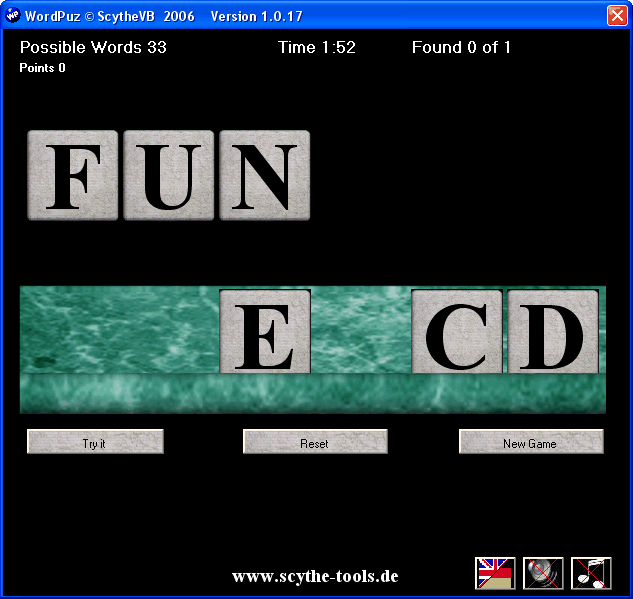



## WordPuz  \(Updated\)

### Description

Test your Brain with this nice Puzzle game.WordPuz shows you 6 letters. Now its your turn to find the possible words.Included: English and German Language Pack and Wordlist Tools to create your own Language Pack and Wordlists. Sept. 8.: Added Italian Language Pack.(Menu translation thru google) Sept. 9. Fixed 2 errors in Lng &amp; Wordlist tools see comments.
 
### More Info
 

             |
---                |---
**Submitted On**   |2006-09-08 10:16:48
**By**             |[Scythe](https://github.com/Planet-Source-Code/PSCIndex/blob/master/ByAuthor/scythe.md)
**Level**          |Intermediate
**User Rating**    |4.8 (24 globes from 5 users)
**Compatibility**  |VB 5\.0, VB 6\.0
**Category**       |[Games](https://github.com/Planet-Source-Code/PSCIndex/blob/master/ByCategory/games__1-38.md)
**World**          |[Visual Basic](https://github.com/Planet-Source-Code/PSCIndex/blob/master/ByWorld/visual-basic.md)
**Archive File**   |[WordPuz\_\_\(201899992006\.zip](https://github.com/Planet-Source-Code/scythe-wordpuz-updated__1-66482/archive/master.zip)

